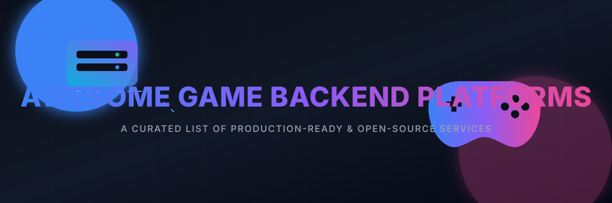

# Awesome Game Backend Platforms 🎮

A curated list of awesome **game backend platforms**, **real-time multiplayer servers**, **managed game hosting**, and **open-source BaaS (Backend-as-a-Service) frameworks** for game development. 

These solutions provide critical server-side infrastructure for online games: player authentication, cloud save, player data storage, matchmaking, real-time networking, leaderboards, chat, inventory, economy, analytics, and live-ops.

Below is a curated directory of notable SaaS platforms and self-hostable open-source equivalents to build scalable games without vendor lock-in.

## 🔍 Similar Projects to Game Backend Platforms

Leading commercial and managed platforms include Heroic Labs Nakama, AccelByte, Beamable, Pragma Platform, LootLocker, PlayFab, Edgegap, Photon Engine, Unity Gaming Services, Epic Online Services, GameSparks (Amazon), BrainCloud, and Backendless.

## 🏢 SaaS / Hosted Platforms

| Platform | Company Size (Valuation/Revenue) | Description | Free Tier Limit | Pricing Model / Paid Plans |
| :--- | :--- | :--- | :--- | :--- |
| **[PlayFab](https://playfab.com/)** (Microsoft) | ~$3.45 Trillion (Valuation) | Comprehensive live-ops and backend platform with auth, multiplayer, economy, analytics, and cloud scripting. | Up to 1,000 lifetime player accounts (Development Mode); Free for Xbox games (Foundation Mode). | Pay-as-you-go based on consumption meters once live. |
| **GameSparks** (Amazon) | ~$1.90 Trillion (Valuation) | Legacy managed game backend (now largely transitioned into other Amazon/AWS offerings). | Discontinued / Not available. | Legacy/Discontinued. |
| **[Epic Online Services (EOS)](https://dev.epicgames.com/en-US/services)** (Epic Games) | ~$22.50 Billion (Valuation) | Free cross-platform online services from Epic (auth, lobbies, matchmaking, achievements, voice, etc.). | 100% Free / No usage caps. | Completely Free. |
| **[Unity Gaming Services](https://unity.com/products/gaming-services)** (Unity) | ~$13.84 Billion (Valuation) | Suite of backend services from Unity (Lobby, Matchmaker, Relay, Cloud Save, Economy, etc.). | Service-specific free limits (e.g., Analytics up to 50k MAU, Vivox up to 5k CCU, 10 GiB Lobby bandwidth). | Pay-as-you-go based on actual consumption over free tier limits. |
| **[AccelByte](https://accelbyte.io/)** | ~$150 Million (Valuation) | Enterprise-grade game backend and live-ops platform focused on multiplayer and player engagement. | 90-day free trial; Free up to 30 peak CCU on AGS Public Cloud (requires credit card after 90 days). | Usage-based pay-as-you-go for Public Cloud; Custom enterprise pricing for Private Cloud (starts at $1,500–$3,500+/mo). |
| **[Pragma Platform](https://www.pragma.gg/)** | ~$150 Million (Valuation) | Backend platform designed for live-service games. | 30-day trial; Free "Basic" support tier (community, Discord, and documentation access only). | Sales-led enterprise pricing with custom contracts. |
| **[Edgegap](https://edgegap.com/)** | ~$25 Million (Valuation) | Orchestration and hosting platform for dedicated game servers with edge deployment. | Dev/testing tier: 1 hour uptime per deployment, 1.5 vCPU, 1 concurrent deployment, 3 hours matchmaking. | Pay-per-use usage-based pricing for production. |
| **[Beamable](https://beamable.com/)** | ~$25 Million (Valuation) | Managed live-ops and backend platform with C# microservices support. | 90-day free trial (equivalent to Developer tier). | Usage-based model (e.g., $100 per 10 million API calls) + tiered plans based on MAU/API volume. |
| **[Photon Engine](https://www.photonengine.com/)** | ~$20 Million (Annual Revenue) | Popular real-time multiplayer networking platform (Photon Realtime, PUN, Fusion, Quantum) with managed cloud options. | 20 CCU free tier for development/non-commercial; 100 CCU free tier for Fusion & Quantum. | Tiered CCU packages (e.g., 200 CCU, 500 CCU) or pay-as-you-go bursting. |
| **[LootLocker](https://lootlocker.com/)** | ~$15 Million (Valuation) | Indie-friendly game backend focused on progression, inventory, leaderboards, and economy. | 30-day trial (up to 1,000 MAU); Free non-commercial license for students and hobbyists. | Usage-based scaling model based on MAU (Fair Use Agreement). |
| **[Backendless](https://backendless.com/)** | ~$15 Million (Valuation) | Backend-as-a-Service solution sometimes used for game features. | Free Plan: 50 requests/min, 1,000 requests/day, 20 data tables, 15,000 database records, 1 GB storage. | Scale Plan (variable/fixed options); Backendless Pro (on-premise/installable). |
| **[BrainCloud](https://braincloud.com/)** | ~$10 Million (Valuation) | Backend-as-a-Service solution used for game features (databases, cloud code, analytics). | Free Development Plan: up to 100 DAU, 1,000 lifetime users, no real IAP. | Development Plus ($5/mo); Paid subscription plans once live (pay-as-you-go based on usage). |

## 🔓 Open-Source Software

### 🚀 Full Game Backend Servers
- **[Nakama](https://github.com/heroiclabs/nakama)**  (Heroic Labs) — The leading open-source game backend (Apache 2.0). Provides real-time multiplayer, matchmaking, leaderboards, chat, storage, authentication, parties, and server-authoritative logic (Go, TypeScript, Lua runtimes). Excellent SDKs for Unity, Unreal, Godot, and more. Can be self-hosted or run via Heroic Cloud.
- **[Colyseus](https://github.com/colyseus/colyseus)**  — Popular open-source multiplayer framework for Node.js / TypeScript. Focuses on room-based real-time games with state synchronization. Great for browser and multiplayer experiences.
- **[Pitaya](https://github.com/topfreegames/pitaya)**  — Scalable open-source game server framework written in Go, with clustering support and client libraries for multiple platforms.
- **[Lance](https://github.com/lance-gg/lance)**  — Open-source real-time multiplayer game server based on Node.js, with client-side prediction, interpolation, and efficient networking.
- **[Talo](https://github.com/TaloDev)**  — Modern open-source (MIT), self-hostable game backend focused on indie developers. Includes player management, leaderboards, cloud saves, analytics, live config, and multiplayer features.

### 🌐 Dedicated Server Orchestration & Infrastructure
- **[Agones](https://github.com/googleforgames/agones)**  — Open-source dedicated game server hosting and scaling solution built on Kubernetes. Excellent for managing fleets of game servers.
- Other Kubernetes-based or container orchestration tools commonly paired with the backends above.

### 🛠️ Additional Open-Source Frameworks
- Various Go, Node.js, Erlang, and C++ game server frameworks available on GitHub (e.g., nano, leaf, Overworld, and community projects) that provide networking, entity systems, and multiplayer primitives.
- Open-source MMO frameworks and server emulators (more specialized, often used for learning or specific genres).

### 📋 Typical Open-Source Stack
1. **🧠 Core backend** — Nakama or Colyseus / Pitaya / Talo
2. **🖥️ Dedicated servers** — Agones (for authoritative game servers) or custom containers
3. **🗄️ Database** — PostgreSQL, CockroachDB, or Redis (often used alongside Nakama)
4. **🤝 Matchmaking & social** — Built into Nakama or implemented via custom modules
5. **📊 Analytics & live-ops** — Self-hosted tools or lightweight event pipelines

This approach gives full ownership of player data, no per-CCU or per-MAU surprises, and the flexibility to customize every part of the backend.

---

**🤝 How to contribute**  
Fork this repository, add a new project (with link + short description + category), and open a pull request.  
Prefer actively maintained open-source projects for game backends, multiplayer servers, matchmaking, or live-ops infrastructure.

**📜 License**  
This list is public domain / CC0. Feel free to copy into your own awesome list or README.

Star the projects you find useful — open-source game backends empower developers to own their multiplayer stack! 🎮
